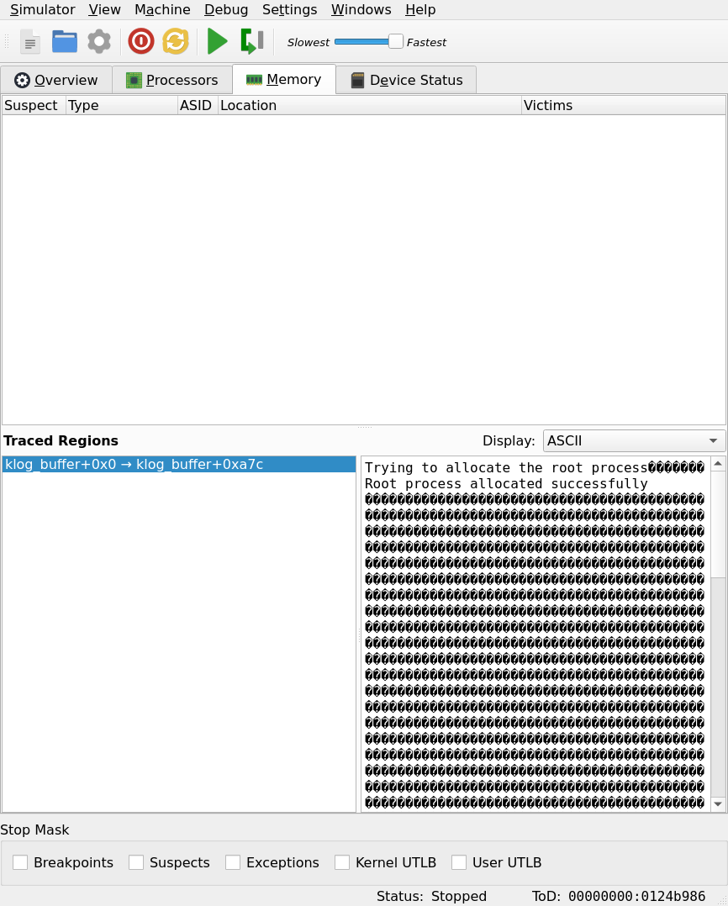

# Reliable logging

## Introduction

In the previous tutorial we have seen how to use µMPS3's debugging facilities. Here I will show a more complex example, detailing a somewhat reliable output channel for debugging purposes.

## Problem

µMPS3's main output channels are its devices. When compared to real life hardware they have a greatly simplified interface; however, they are not optimal tools to convey debugging information, for several reasons:

 1. They are asynchronous by nature. This makes a device driver inherently complex and error prone. The same task of setting up a terminal to show debug output may prove quite hard without the output that is needed in the first place.
 2. Following the specification of PandOS, they are reserved to processes. The kernel doesn't have the luxury of hogging an entire device to itself, and even if it did there would still be the issue of asynchrony. The kernel cannot simply print a message while handling an interrupt because the message itself should be spanned throught multiple following interrupts, making it stale information by the time it's done.
 3. They are slow. Even printing a single character requires a period of time in an order of magnitude much greater than normal execution speed, which may influence the problem we are trying to diagnose in the first place.

In short, something simpler is required. Since we need a tool for development purposes, we can take advantage of other debugging capabilities; mainly, the memory tracing.
We have already seen how to inspect what character is being printed by displaying the contents of a variable in memory. Now it's just a matter of expanding on this principle.

## Solution

First, we need to define the buffer that will be the destination for our messages. For ease of use we can already split it in lines:

``` C
unsigned int klog_line_index                         = 0;
unsigned int klog_char_index                         = 0;
char         klog_buffer[KLOG_LINES][KLOG_LINE_SIZE] = {0};
```

    Note: Since `klog_buffer` has no other purpose than to be shown by memory tracing, you might be tempted to prefix it with an underscore.
    Be aware that variables named this way do not appear in the traceable list; this is a way to hide BIOS related variables.

Where `KLOG_LINES` and `KLOG_LINE_SIZE` are two macros defining how many lines of log we allow before circling back (memory is finite after all) and the size in characters for each line.
The two indexes keep track of the current line we are printing on and the next character position, respectively.

Next we implement a couple of functions to appropriately move said indexes forward:

``` C
static void next_char(void) {
    if (++klog_char_index >= KLOG_LINE_SIZE) {
        klog_char_index = 0;
        next_line();
    }
}


static void next_line(void) {
    klog_line_index = (klog_line_index + 1) % KLOG_LINES;
    klog_char_index = 0;
    for (unsigned int i = 0; i < KLOG_LINE_SIZE; i++) {
        klog_buffer[klog_line_index][i] = ' ';
    }
}
```

Last, the actual print function that puts a message into the buffer:

``` C
void klog_print(char *str) {
    while (*str != '\0') {
        if (*str == '\n') {
            next_line();
            str++;
        } 
        else {
            klog_buffer[klog_line_index][klog_char_index] = *str++;
            next_char();
        }
    }
}
```

This does little more than copying the parameter string into the next available line, overflowing or overwriting previous characters if necessary and skipping to the next one if the newline character is found.

With this little library we can print some information, for example after initializing the system:

``` C
    klog_print("Trying to allocate the root process\n");
    pcb_t *p = allocPcb();
    if (p == NULL) {
        klog_print("Allocation failed!\n");
        PANIC();
    } else {
        klog_print("Root process allocated successfully\n");
    }
```

During execution, this is the final result:

.

The question marks are just non-printable characters (i.e. `'\0'`) and if we printed more lines than those are available in the buffer it would simply roll over.

The memory trace tab does not know anything about our arbitrary line size, so it may not align them. However, the UI can be appropriately resized to accomodate.

## Conclusion

This solution creates a simple output channel that can be used by processes and kernel code alike (beware: processes might still incur in race conditions while writing to `klog_buffer`, so perhaps a separate instance guarded by a mutex would be more appropriate).
Since it only moves characters in memory it has a negligible overhead both in terms of computational time and required resources.

This is the full code. I have also added an extra `klog_print_hex` function that prints an index in hexadecimal format in the log. It can be useful to display pointers and such.

``` C
*
 * @file klog.c
 * @author Maldus512 
 * @brief Small library that implements a circular log buffer. When properly traced (with ASCII representation),
 *          `klog_buffer` displays a series of printed lines.
 */

#define KLOG_LINES     64     // Number of lines in the buffer. Adjustable, only limited by available memory
#define KLOG_LINE_SIZE 42     // Length of a single line in characters


static void next_line(void);
static void next_char(void);


unsigned int klog_line_index                         = 0;       // Index of the next line to fill
unsigned int klog_char_index                         = 0;       // Index of the current character in the line
char         klog_buffer[KLOG_LINES][KLOG_LINE_SIZE] = {0};     // Actual buffer, to be traced in uMPS3


// Print str to klog
void klog_print(char *str) {
    while (*str != '\0') {
        // If there is a newline skip to the next one
        if (*str == '\n') {
            next_line();
            str++;
        } 
        // Otherwise just fill the current one
        else {
            klog_buffer[klog_line_index][klog_char_index] = *str++;
            next_char();
        }
    }
}


// Princ a number in hexadecimal format (best for addresses)
void klog_print_hex(unsigned int num) {
    const char digits[] = "0123456789ABCDEF";

    do {
        klog_buffer[klog_line_index][klog_char_index] = digits[num % 16];
        num /= 16;
        next_char();
    } while (num > 0);
}


// Move onto the next character (and into the next line if the current one overflows)
static void next_char(void) {
    if (++klog_char_index >= KLOG_LINE_SIZE) {
        klog_char_index = 0;
        next_line();
    }
}


// Skip to next line
static void next_line(void) {
    klog_line_index = (klog_line_index + 1) % KLOG_LINES;
    klog_char_index = 0;
    // Clean out the rest of the line for aesthetic purposes
    for (unsigned int i = 0; i < KLOG_LINE_SIZE; i++) {
        klog_buffer[klog_line_index][i] = ' ';
    }
}
```